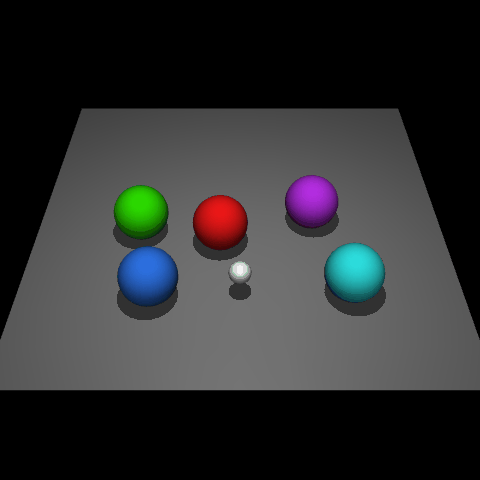
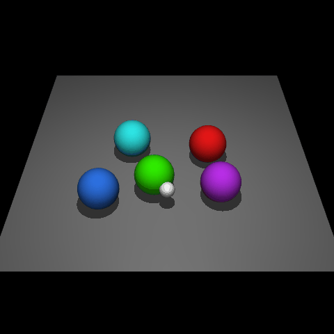
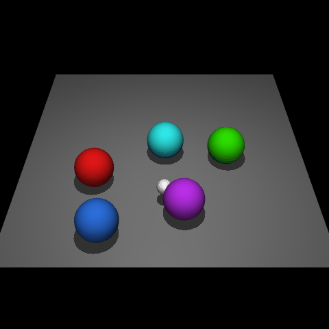

# Knowledgeable Agents by Offline Reinforcement Learning from Large Language Model Rollouts

## Demonstration of imaginary rollouts

| Tasks | Description | Demonstration |
|  :----:  | :----:  | :----:  |
| Rephrasing Goal (CLEVR-Robot) | A single demonstration of imaginary rollouts for rephrasing goal tasks on CLEVR-Robot. Instrution: *Propel the red-colored orb forward, leading the blue-colored orb.* |     |
| Unseen-Easy (CLEVR-Robot) | A single demonstration of imaginary rollouts for unseen-easy goal tasks on CLEVR-Robot. Instruction: *Could you shift the blue ball to the right?* |     |
| Unseen-Hard (CLEVR-Robot) | A single demonstration of imaginary rollouts for unseen-hard goal tasks on CLEVR-Robot. Instruction: *Use the green ball as the nucleus of the circle, arranging the rest around it.* |     |
| Rephrasing Goal (Meta-World) | A single demonstration of imaginary rollouts for rephrasing goal tasks on Meta-World. Instruction: *Utilize the gripper system to navigate the specified object to the desired destination.* |     |
| Unseen-Easy (Meta-World) | A single demonstration of imaginary rollouts for unseen-easy goal tasks on Meta-World. Instruction: *Position the gripper to reach the target area, with awareness of the wall obstructing the path.* |     |
| Unseen-Hard (Meta-World) | A single demonstration of imaginary rollouts for unseen-hard goal tasks on Meta-World. Instruction: *Employ the gripper to maneuver the coffee mug into place beneath the coffee machine's spout, ready for brewing.* |     |
