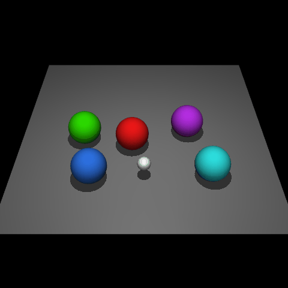
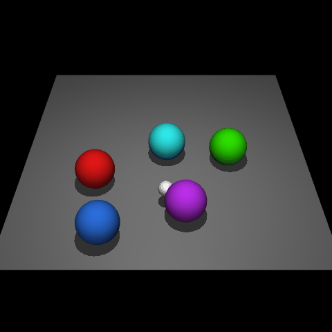
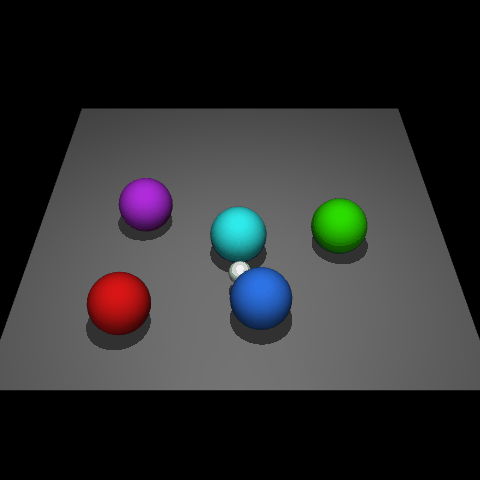
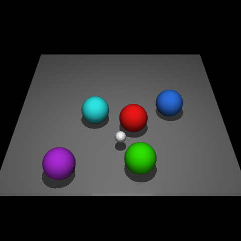

# Knowledgeable Agents by Offline Reinforcement Learning from Large Language Model Rollouts

## Demonstration of imaginary rollouts
<!-- CLEVR-Robot -->
|  |     |
|  :----: | :----:  |
| Goal: *Propel the red-colored orb forward, leading the blue-colored orb.* | Goal: *Use the green ball as the nucleus of the circle, arranging the rest around it.* |

|  |     |
|  :----: | :----:  |
| Goal: *Move the ball that has the color red to the right.* | Goal: *Could you please transfer the purple ball towards the left?* |

<!-- Meta-World -->
|  |     |
|  :----: | :----:  |
| Goal: *Employ the gripper tool to pick up the desired object and move it to the intended location,   notwithstanding the hindrance of a wall in the path.* | Goal: *Position the gripper to reach the target area, with awareness of the wall obstructing the path.* |

|  |     |
|  :----: | :----:  |
| Goal: *Utilize the gripper to terminate the faucet's function.* | Goal: *Utilize the gripper system to navigate the specified object to the desired destination.* |
